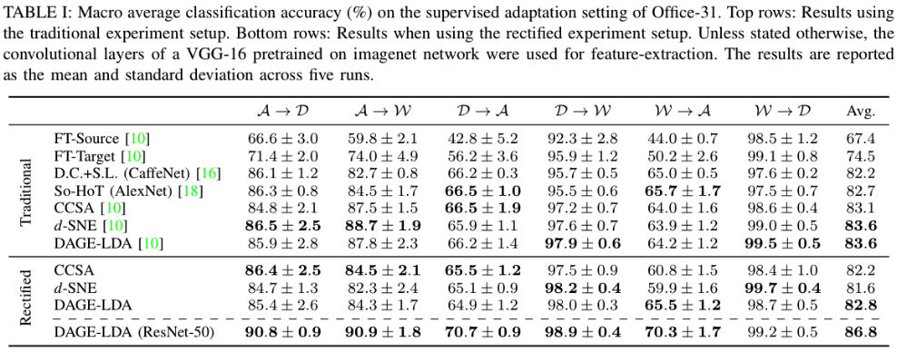
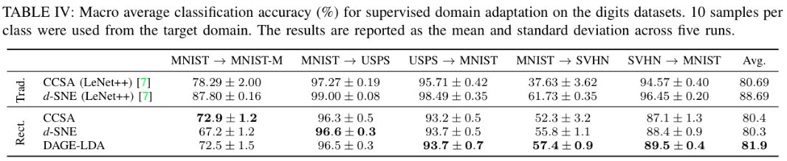
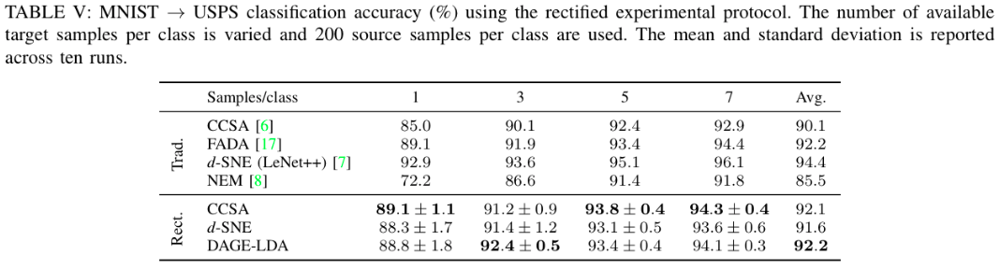

# Domain Adaption using Graph Embedding (DAGE)
[](https://arxiv.org/abs/2004.11262)
[](https://arxiv.org/abs/2003.04063)
[](https://www.micc.unifi.it/icpr2020/)

This repository supplies an implementation of a the supervised domain adaptation method [Domain Adaptation using Graph Embedding (DAGE)](https://arxiv.org/abs/2003.04063).

We additionally provide implementations of the following baseline transfer learning and domain adaptation methods:
* Fine tuning using gradual unfreeze
* [CCSA](https://arxiv.org/abs/1906.00684)
* [d-SNE](http://openaccess.thecvf.com/content_CVPR_2019/papers/Xu_d-SNE_Domain_Adaptation_Using_Stochastic_Neighborhood_Embedding_CVPR_2019_paper.pdf)

## Setup

### Install dependencies
```bash
$ conda create --name dage python=3.7
$ conda activate dage
$ pip install -r requirements.txt
```

If issues are encountered with scikit-optimize, the exact git tag can be installed via: 
`pip install git+https://github.com/scikit-optimize/scikit-optimize.git@af5450a51599bbfa4846342188948c147ceba14c`

NB: The Tensorflow version used here assumes that CUDA 10.0 is installed.

### Download datasets
```bash
$ ./scripts/get_office.sh
$ ./scripts/get_digits.sh
```


## Running the code
```run.py``` is the entry-point for running the implemented methods. 
To retreive a list of valid arguments, use ```python run.py --help```.

A number of ready-to-run scripts are supplied (found in the `scripts` folder), with which one can test different methods and configurations.

An example which tunes a model on source data, and tests on target data is
```bash
$ ./scripts/office31_tune_source.sh
```
Running DAGE of Office31 with tuned hyperparameters using the revised training splits is acheived by using.
```bash
$ ./scripts/office31_dage_lda_tuned_vgg16_v2.sh
```

Note: The experiments were run on two separate occations. The first time was using the standard approach used in much domain adaptation literature. The second time (the accompaning scripts are postfixed with "_v2") the revised data splits were used to ensure generaliseability of the results.


## Hyper-parameter optimisation
A separate python entry-point ```hypersearch.py``` can be used to perform a hyper-parameter search using Bayesian Optimisation.
Script are also supplied for performing a hyperparameter optimisation
```bash
$ ./scripts/office31_hypersearch.sh
```


## Results
The results come in two flavours. One set of results are for the traditional experimental setup, where the test split is used for validation. The other set are for a rectified experimental protocol], in which the test set is used only for final testing and a propper validation split is defined.

<div align="center">
  <br>

  <br>
  
  <br>
</div>


[Source](https://arxiv.org/abs/2004.11262)

## Authors

* **Lukas Hedegaard** - https://github.com/lukashedegaard
* **Omar Ali Sheikh-Omar** -  https://github.com/sheikhomar
* **Alexandros Iosifidis** -  https://github.com/AlekosIosifidis

## Citation

```bibtex

@article{hedegaard2021supervised,
    title={Supervised Domain Adaptation: A Graph Embedding Perspective and a Rectified Experimental Protocol}, 
    author={Lukas Hedegaard and Omar Ali Sheikh-Omar and Alexandros Iosifidis},
    year={2021},
    eprint={2004.11262},
    archivePrefix={arXiv},
    primaryClass={cs.LG}
    journal={preprint, arXiv:2004.11262}
}
```

```bibtex
@article{hedegaard2020supervised,
    title={Supervised Domain Adaptation using Graph Embedding},
    author={Lukas Hedegaard and Omar Ali Sheikh-Omar and Alexandros Iosifidis},
    journal={International Conference on Pattern Recognition (ICPR)}
    year={2020},
}
```
